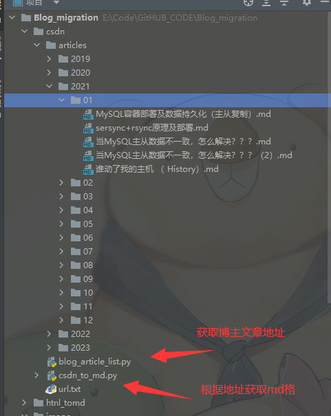

# Blog_migration
Blog migration 
同步CSDN的文章博客

# 整体架构思路

1、采用Python的tomd 模块语法，爬取CSDN的博客，转化为MD格式

2、采用Hugo框架构建纯静态（HTML）页面

3、采用爬虫，爬取http://www.netbian.com/e/search/result/index.php?page=0&searchid=4279

的高清图片，作为Hugo 的镇楼图片。

爬取界面

爬取CSDN

1、优先爬取博主文章地址

2、根据文章地址下载转换MD格式

Hugo 博客

参考地址：https://nangongchengfeng.github.io/

