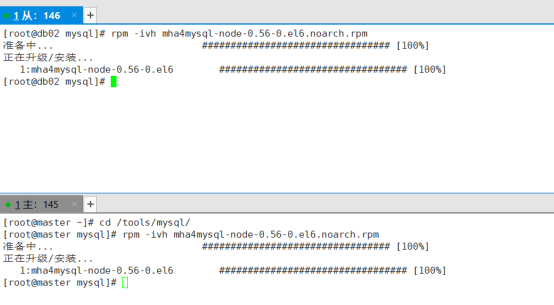

+++
author = "南宫乘风"
title = "MHA架构实施（一主一从）学不会，你来打我？加油！奥利给"
date = "2020-06-24 11:43:46"
tags=['mysql', '负载均衡器', 'MHA', '主从复制', '集群']
categories=['MySQL']
image = "post/4kdongman/88.jpg"
+++
[作者：南宫乘风   原文链接:https://blog.csdn.net/heian_99/article/details/106939828?spm=1001.2014.3001.5502](https://blog.csdn.net/heian_99/article/details/106939828?spm=1001.2014.3001.5502)

目录


 

1、环境要求

2、架构工作原理

2.1架构介绍:

2.2 MHA软件构成

3、Mysql环境搭建

3.1环境准备（主从都需要下面步骤）

3.2用户的创建处理原始环境

3.3解压文件，更改文件目录

3.4设置环境变量

3.5环境目录规划

3.6my.cnf配置文件

3.7mysql数据库初始化

3.8启动数据库2种方式

1. sys-v

2. systemd

3.9修改数据库的密码

4、mysql主从配置

1、主库创建用户（db01）

2、从库开启连接（db02）

5、MHA环境搭建

5.1配置关键程序软连接

5.2配置各个节点互信

5.3安装MHA软件

1、所有节点安装Node软件依赖包

2、在db01主库中创建mha需要的用户

3、Manager软件安装（db02）

5.4配置文件准备（db02）

5.5状态检查

互信检查

主从状态检查

5.6开启HMA（db02）

开启

检测MHA状态

6、MHA 的vip功能

参数

修改脚本内容

更改manager配置文件：

主库上，手工生成第一个vip地址

重启mha

7、 binlog server（db02）

参数：

创建必要目录

拉取主库binlog日志

重启MHA

8、邮件提醒

1. 参数

2. 准备邮件脚本

3. 修改manager配置文件，调用邮件脚本

重启MHA

9、测试MHA

关闭主库,看警告邮件  

# **1、环境要求**


MHA实施文档： MHA实施文档.pdf-群集服务文档类资源-CSDN下载


MHA实施软件集合： MHA实施文档.zip-群集服务文档类资源-CSDN下载（包含所用到的软件）


系统：CentOS Linux release 7.4.1708 (Core)

Myssql：5.7.20

MHA：mha4mysql-manager-0.56-0.el6.noarch

           mha4mysql-node-0.56-0.el6.noarch


<td style="vertical-align:top;width:138.25pt;"> 主机 </td><td style="vertical-align:top;width:138.25pt;"> IP </td><td style="vertical-align:top;width:138.3pt;"> 端口 </td>

IP
<td style="vertical-align:top;width:138.25pt;"> 主库（db01） </td><td style="vertical-align:top;width:138.25pt;"> 172.17.1.145 </td><td style="vertical-align:top;width:138.3pt;"> 3306 </td>

172.17.1.145
<td style="vertical-align:top;width:138.25pt;"> 从库（db02） </td><td style="vertical-align:top;width:138.25pt;"> 172.17.1.146 </td><td style="vertical-align:top;width:138.3pt;"> 3306 </td>

172.17.1.146
<td style="vertical-align:top;width:138.25pt;"> 虚拟ip（vrrp漂移） </td><td style="vertical-align:top;width:138.25pt;"> 172.17.1.100 </td><td style="vertical-align:top;width:138.3pt;">  </td>

172.17.1.100


# **2、架构工作原理**

主库宕机处理过程

1. 监控节点 (通过配置文件获取所有节点信息)

>  
    系统,网络,SSH连接性 
    主从状态,重点是主库 


2. 选主

(1) 如果判断从库(position或者GTID),数据有差异,最接近于Master的slave,成为备选主

(2) 如果判断从库(position或者GTID),数据一致,按照配置文件顺序,选主.

(3) 如果设定有权重(candidate_master=1),按照权重强制指定备选主.

>  
     1. 默认情况下如果一个slave落后master 100M的relay logs的话，即使有权重,也会失效. 
     2. 如果check_repl_delay=0的化,即使落后很多日志,也强制选择其为备选主 


3. 数据补偿

>  
 (1) 当SSH能连接,从库对比主库GTID 或者position号,立即将二进制日志保存至各个从节点并且应用(save_binary_logs ) 
 (2) 当SSH不能连接, 对比从库之间的relaylog的差异(apply_diff_relay_logs) 


4. Failover

将备选主进行身份切换,对外提供服务

其余从库和新主库确认新的主从关系

5. 应用透明(VIP)

6. 故障切换通知(send_reprt)

7. 二次数据补偿(binlog_server)

## **2.1架构介绍:**

>  
 1主1从，master：db01   slave：db02 ）： 
 MHA 高可用方案软件构成 
 Manager软件：选择一个从节点安装 
 Node软件：所有节点都要安装 


## **2.2 MHA软件构成**

anager工具包主要包括以下几个工具：

>  
 masterha_manger             启动MHA 
 masterha_check_ssh      检查MHA的SSH配置状况 
 masterha_check_repl         检查MySQL复制状况 
 masterha_master_monitor     检测master是否宕机 
 masterha_check_status       检测当前MHA运行状态 
 masterha_master_switch  控制故障转移（自动或者手动） 
 masterha_conf_host      添加或删除配置的server信息 


Node工具包主要包括以下几个工具：

这些工具通常由MHA Manager的脚本触发，无需人为操作

>  
 save_binary_logs            保存和复制master的二进制日志 
 apply_diff_relay_logs       识别差异的中继日志事件并将其差异的事件应用于其他的 
 purge_relay_logs            清除中继日志（不会阻塞SQL线程） 


# **3、Mysql环境搭建**


## **3.1环境准备（主从都需要下面步骤）**

创建目录，上传所需要的文件（主从都需要上传）

```
[root@db01 ~]# mkdir -p /tools/mysql
[root@db01 ~]# cd  /tools/mysql
[root@db01 mysql]# scp * root@172.17.1.146:/tools/mysql/
```


## **3.2用户的创建处理原始环境**

```
[root@db01 ~]# rpm -qa |grep mariadb
[root@db01 ~]# yum remove mariadb-libs-5.5.56-2.el7.x86_64 -y
添加mysql用户
 [root@db01 ~]# useradd -s /sbin/nologin mysql
```

## **3.3解压文件，更改文件目录**

```
存放mysql程序目录
[root@db01 mysql]# mkdir -p /app
解压
[root@db01 mysql]# tar xf mysql-5.7.20-linux-glibc2.12-x86_64.tar.gz 
移动
[root@db01 mysql]# mv mysql-5.7.20-linux-glibc2.12-x86_64 /app/mysql
```

### **3.4设置环境变量**

```

vim /etc/profile

export PATH=/app/mysql/bin:$PATH

[root@db01 ~]# source /etc/profile

[root@db01 ~]# mysql -V

mysql  Ver 14.14 Distrib 5.7.20, for linux-glibc2.12 (x86_64) using  EditLine wrapper
```


## **3.5环境目录规划**


创建文件，并授权

```
[root@db01 mysql]# 
[root@db01 mysql]# mkdir -p /data/{mysql,binlog}
[root@db01 mysql]# mkdir -p /data/mysql/data
[root@db01 mysql]# chown -R mysql.mysql /app/mysql/*
[root@db01 mysql]# chown -R mysql.mysql /data/*
```

错误日志存放

```
[root@db01 ~]# touch /var/log/mysql.log
[root@db01 ~]# chown mysql.mysql /var/log/mysql.log
[root@db01 ~]# ll /var/log/mysql.log
-rw-r--r-- 1 mysql mysql 0 6月  21 20:38 /var/log/mysql.log
```

Sock环境配置

```
[root@db01 data]# touch /tmp/mysql.sock
[root@db01 data]# chown mysql.mysql /tmp/mysql.sock
```

慢日志（有需要可以加下面参数）

```
开关:
slow_query_log=1 
文件位置及名字 
slow_query_log_file=/data/mysql/slow.log
设定慢查询时间:
long_query_time=0.1
没走索引的语句也记录:
log_queries_not_using_indexes
```

## **3.6my.cnf配置文件**

主库server_id=145

从库server_id=146

```
[mysqld]
basedir=/data/mysql
datadir=/data/mysql/data
socket=/tmp/mysql.sock
#错误日志
log_error=/var/log/mysql.log
log_timestamps=system
#server_id
server_id=145
port=3306
secure-file-priv=/tmp
autocommit=0
log_bin=/data/binlog/mysql-bin
binlog_format=row
#GTID
gtid-mode=on
enforce-gtid-consistency=true
log-slave-updates=1
# 允许最大连接数
max_connections=200
# 服务端使用的字符集默认为8比特编码的latin1字符集
character-set-server=utf8
# 创建新表时将使用的默认存储引擎
default-storage-engine=INNODB
[mysql]
socket=/tmp/mysql.sock
prompt=db01 [\d]&gt;
```

## **3.7mysql数据库初始化**

```
[root@db01 ~]# mysqld --initialize-insecure --user=mysql --basedir=/app/mysql --datadir=/data/mysql/data
```

## **3.8启动数据库2种方式**

### **1. sys-v **

```
[root@db01 data]# cp /app/mysql/support-files/mysql.server  /etc/init.d/mysqld 
[root@db01 data]# vim /etc/init.d/mysqld 
[root@db01 data]# grep -Ev "^(#|$)" /etc/init.d/mysqld
 
basedir=/app/mysql
datadir=/data/mysql/data
………………………………………..
```

```
[root@db02 mysql]# service mysqld restart
[root@db02 mysql]# service mysqld stop
[root@db02 mysql]# service mysqld start
```

```
[root@db02 mysql]# /etc/init.d/mysqld restart
[root@db02 mysql]# /etc/init.d/mysqld stop
[root@db02 mysql]# /etc/init.d/mysqld start
```

### **2. systemd **

注意： sysv方式启动过的话，需要先提前关闭，才能以下方式登录

```
cat &gt;/etc/systemd/system/mysqld.service &lt;&lt;EOF
[Unit]
Description=MySQL Server
Documentation=man:mysqld(8)
Documentation=http://dev.mysql.com/doc/refman/en/using-systemd.html
After=network.target
After=syslog.target
[Install]
WantedBy=multi-user.target
[Service]
User=mysql
Group=mysql
ExecStart=/app/mysql/bin/mysqld --defaults-file=/etc/my.cnf
LimitNOFILE = 5000
EOF
```

```
[root@db02 mysql]# systemctl restart mysqld
[root@db02 mysql]# systemctl stop mysqld
[root@db02 mysql]# systemctl start mysqld
```


## **3.9修改数据库的密码**

注意：5.8以上数据库，需要先创用户，授权

      5.7的数据库，你授权时，就行给你创建用户

（坑：在更改密码时，要注意空格，防止密码里有空格，而自己没注意

```
use mysql;
本地连接密码
grant all on *.* to root@'localhost' identified by 'xdzh@2020';
同一网段可连接的root权限
grant all on *.* to root@'172.17.1.%' identified by 'xdzh@2020';
刷新权限表
flush privileges;
```


本地登录测试


# **4、mysql主从配置**

## 1、主库创建用户（db01**）**

账号密码可以自己定义

```
grant replication slave  on *.* to repl@'172.17.1.%' identified by '123';
flush privileges;
```


## **2、从库开启连接（db02）**

执行语句，连接主库，同步数据

```
change master to 
master_host='172.17.1.145',
master_user='repl',
master_password='123' ,
MASTER_AUTO_POSITION=1;
```

开启从库

```
start slave;
```


查看用户


# **5、MHA环境搭建**

规划
<td style="vertical-align:top;width:207.4pt;"> 主机 </td><td style="vertical-align:top;width:207.4pt;"> MHA软件 </td>

MHA软件
<td style="vertical-align:top;width:207.4pt;"> 主库（db01） </td><td style="vertical-align:top;width:207.4pt;"> Node </td>

Node
<td style="vertical-align:top;width:207.4pt;"> 从库（db02） </td><td style="vertical-align:top;width:207.4pt;"> Node，Master </td>

Node，Master

## **5.1配置关键程序软连接**

注意：一定要配置，不然后面数据库切换会出现问题（主从都配置）

```
ln -s /app/mysql/bin/mysqlbinlog    /usr/bin/mysqlbinlog
ln -s /app/mysql/bin/mysql          /usr/bin/mysql
```


## **5.2配置各个节点互信**

配置SSH

```
db01：
rm -rf /root/.ssh 
ssh-keygen
cd /root/.ssh 
mv id_rsa.pub authorized_keys
scp  -r  /root/.ssh  172.17.1.146:/root
```

各节点验证：

```
db01:
ssh 172.17.1.145 date
ssh 172.17.1.146 date

db02:
ssh 172.17.1.145 date
ssh 172.17.1.146 date
```

主库


从库


## **5.3安装MHA软件**
<td style="vertical-align:top;width:414.8pt;"> mha官网：https://code.google.com/archive/p/mysql-master-ha/ github下载地址：https://github.com/yoshinorim/mha4mysql-manager/wiki/Downloads </td>

github下载地址：https://github.com/yoshinorim/mha4mysql-manager/wiki/Downloads

### **1、所有节点安装Node软件依赖包**

```
yum install perl-DBD-MySQL -y
rpm -ivh mha4mysql-node-0.56-0.el6.noarch.rpm
```



### **2、在db01主库中创建mha需要的用户**

账号密码可以自己定义

```
grant all privileges on *.* to mha@'172.17.1.%' identified by 'mha';
```


### **3、Manager软件安装（db02）**

注意：这边如果yum安装缺少依赖，换成阿里云的源和epel

```
yum install -y perl-Config-Tiny epel-release perl-Log-Dispatch perl-Parallel-ForkManager perl-Time-HiRes
rpm -ivh mha4mysql-manager-0.56-0.el6.noarch.rpm
```


## **5.4配置文件准备（db02）**

```
创建配置文件目录
 mkdir -p /etc/mha
创建日志目录
 mkdir -p /var/log/mha/app1
```

编辑mha配置文件

```
vim /etc/mha/app1.cnf

[server default]
manager_log=/var/log/mha/app1/manager        
manager_workdir=/var/log/mha/app1            
master_binlog_dir=/data/binlog       
user=mha                                   
password=mha                               
ping_interval=2
repl_password=123
repl_user=repl
ssh_user=root                               
[server1]                                   
hostname=172.17.1.145
port=3306                                  
[server2]            
hostname=172.17.1.146
port=3306

```


## **5.5状态检查**

```
检测repl状态
masterha_check_repl  --conf=/etc/mha/app1.cnf 
检测ssh状态
masterha_check_ssh  --conf=/etc/mha/app1.cnf

检测运行状态
 masterha_check_status --conf=/etc/mha/app1.cnf
```

### **互信检查**
<td style="vertical-align:top;width:414.8pt;"> masterha_check_ssh  --conf=/etc/mha/app1.cnf </td>


### **主从状态检查**
<td style="vertical-align:top;width:414.8pt;"> masterha_check_repl  --conf=/etc/mha/app1.cnf </td>


## **5.6开启HMA（db02）**

### **开启**
<td style="vertical-align:top;width:414.8pt;"> nohup masterha_manager --conf=/etc/mha/app1.cnf --remove_dead_master_conf --ignore_last_failover  &lt; /dev/null&gt; /var/log/mha/app1/manager.log 2&gt;&amp;1 &amp; </td>

### **检测MHA状态**
<td style="vertical-align:top;width:414.8pt;"> masterha_check_status --conf=/etc/mha/app1.cnf  [root@db02 mysql]# masterha_check_status --conf=/etc/mha/app1.cnf app1 (pid:17248) is running(0:PING_OK), master:172.17.1.145 [root@db02 mysql]# mysql -umha -pmha -h172.17.1.145 -e "show variables like 'server_id'" mysql: [Warning] Using a password on the command line interface can be insecure. +---------------+-------+ | Variable_name | Value | +---------------+-------+ | server_id     | 145   | +---------------+-------+ [root@db02 mysql]# mysql -umha -pmha -h172.17.1.146 -e "show variables like 'server_id'" mysql: [Warning] Using a password on the command line interface can be insecure. +---------------+-------+ | Variable_name | Value | +---------------+-------+ | server_id     | 146   | +---------------+-------+ </td>


app1 (pid:17248) is running(0:PING_OK), master:172.17.1.145

mysql: [Warning] Using a password on the command line interface can be insecure.

| Variable_name | Value |

| server_id     | 145   |

[root@db02 mysql]# mysql -umha -pmha -h172.17.1.146 -e "show variables like 'server_id'"

+---------------+-------+

+---------------+-------+

+---------------+-------+


# **6、MHA 的vip功能**

## **参数**

注意：/usr/local/bin/master_ip_failover，必须事先准备好
<td style="vertical-align:top;width:414.8pt;"> master_ip_failover_script=/usr/local/bin/master_ip_failover </td>

## **修改脚本内容**

```
vi  /usr/local/bin/master_ip_failover
my $vip = '172.17.1.100/24';
my $key = '1';
my $ssh_start_vip = "/sbin/ifconfig eth0:$key $vip";
my $ssh_stop_vip = "/sbin/ifconfig eth0:$key down";
```

## **更改manager配置文件：**

```
vi /etc/mha/app1.cnf
添加：
master_ip_failover_script=/usr/local/bin/master_ip_failover
注意：
[root@db03 ~]# dos2unix /usr/local/bin/master_ip_failover 
dos2unix: converting file /usr/local/bin/master_ip_failover to Unix format ...
[root@db03 ~]# chmod +x /usr/local/bin/master_ip_failover
```

## **主库上，手工生成第一个vip地址**
<td style="vertical-align:top;width:414.8pt;"> 手工在主库上绑定vip，注意一定要和配置文件中的ethN一致，我的是eth0:1(1是key指定的值) ifconfig ens33:1 172.17.1.100/24 </td>

ifconfig ens33:1 172.17.1.100/24


## **重启mha**
<td style="vertical-align:top;width:414.8pt;"> masterha_stop --conf=/etc/mha/app1.cnf nohup masterha_manager --conf=/etc/mha/app1.cnf --remove_dead_master_conf --ignore_last_failover &lt; /dev/null &gt; /var/log/mha/app1/manager.log 2&gt;&amp;1 &amp; </td>

nohup masterha_manager --conf=/etc/mha/app1.cnf --remove_dead_master_conf --ignore_last_failover &lt; /dev/null &gt; /var/log/mha/app1/manager.log 2&gt;&amp;1 &amp;

# **7、 binlog server（db02）**

## **参数：**

binlogserver配置：

找一台额外的机器，必须要有5.6以上的版本，支持gtid并开启，我们直接用slave（db02）

vim /etc/mha/app1.cnf

```
[binlog1]
no_master=1
hostname= 172.17.1.146
master_binlog_dir=/data/mysql/binlog
```


## **创建必要目录**
<td style="vertical-align:top;width:414.8pt;"> mkdir -p /data/mysql/binlog chown -R mysql.mysql /data/* 修改完成后，将主库binlog拉过来（从000001开始拉，之后的binlog会自动按顺序过来） </td>

chown -R mysql.mysql /data/*

## **拉取主库binlog日志**
<td style="vertical-align:top;width:414.8pt;"> cd /data/mysql/binlog     -----》必须进入到自己创建好的目录 mysqlbinlog  -R --host=172.17.1.145 --user=mha --password=mha --raw  --stop-never mysql-bin.000001 &amp; 注意： 拉取日志的起点,需要按照目前从库的已经获取到的二进制日志点为起点 </td>

mysqlbinlog  -R --host=172.17.1.145 --user=mha --password=mha --raw  --stop-never mysql-bin.000001 &amp;

拉取日志的起点,需要按照目前从库的已经获取到的二进制日志点为起点


## **重启MHA**
<td style="vertical-align:top;width:414.8pt;"> masterha_stop --conf=/etc/mha/app1.cnf nohup masterha_manager --conf=/etc/mha/app1.cnf --remove_dead_master_conf --ignore_last_failover &lt; /dev/null &gt; /var/log/mha/app1/manager.log 2&gt;&amp;1 &amp; </td>

nohup masterha_manager --conf=/etc/mha/app1.cnf --remove_dead_master_conf --ignore_last_failover &lt; /dev/null &gt; /var/log/mha/app1/manager.log 2&gt;&amp;1 &amp;

# **8、邮件提醒**

## **1. 参数**
<td style="vertical-align:top;width:414.8pt;"> report_script=/usr/local/bin/send </td>

## **2. 准备邮件脚本**

send_report

>  
 (1)准备发邮件的脚本(上传 email_2019-最新.zip中的脚本，到/usr/local/bin/中) 
 (2)将准备好的脚本添加到mha配置文件中,让其调用 


## **3. 修改manager配置文件，调用邮件脚本**

```
vi /etc/mha/app1.cnf
report_script=/usr/local/bin/send
```

## **重启MHA**
<td style="vertical-align:top;width:414.8pt;"> masterha_stop --conf=/etc/mha/app1.cnf nohup masterha_manager --conf=/etc/mha/app1.cnf --remove_dead_master_conf --ignore_last_failover &lt; /dev/null &gt; /var/log/mha/app1/manager.log 2&gt;&amp;1 &amp; </td>

nohup masterha_manager --conf=/etc/mha/app1.cnf --remove_dead_master_conf --ignore_last_failover &lt; /dev/null &gt; /var/log/mha/app1/manager.log 2&gt;&amp;1 &amp;

# **9、测试MHA**

## **关闭主库,看警告邮件  **


切换完后，HMA会退出，还有binlogserver


 145数据库挂掉后，MHA自动切换IP到146上，无需人为修改。


