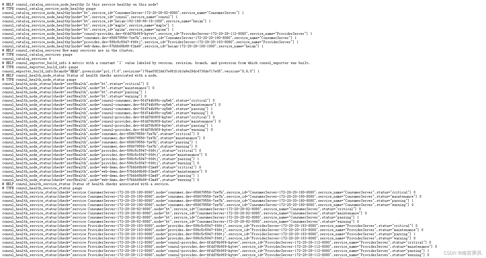
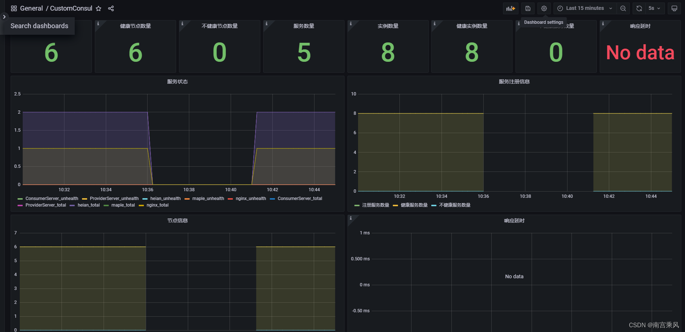
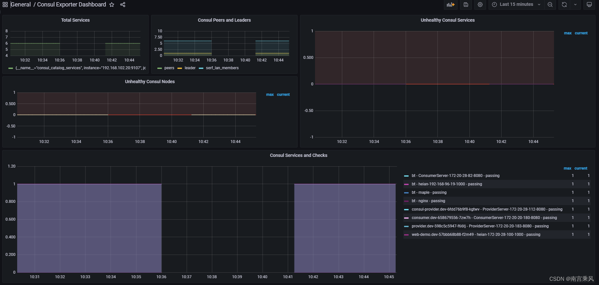
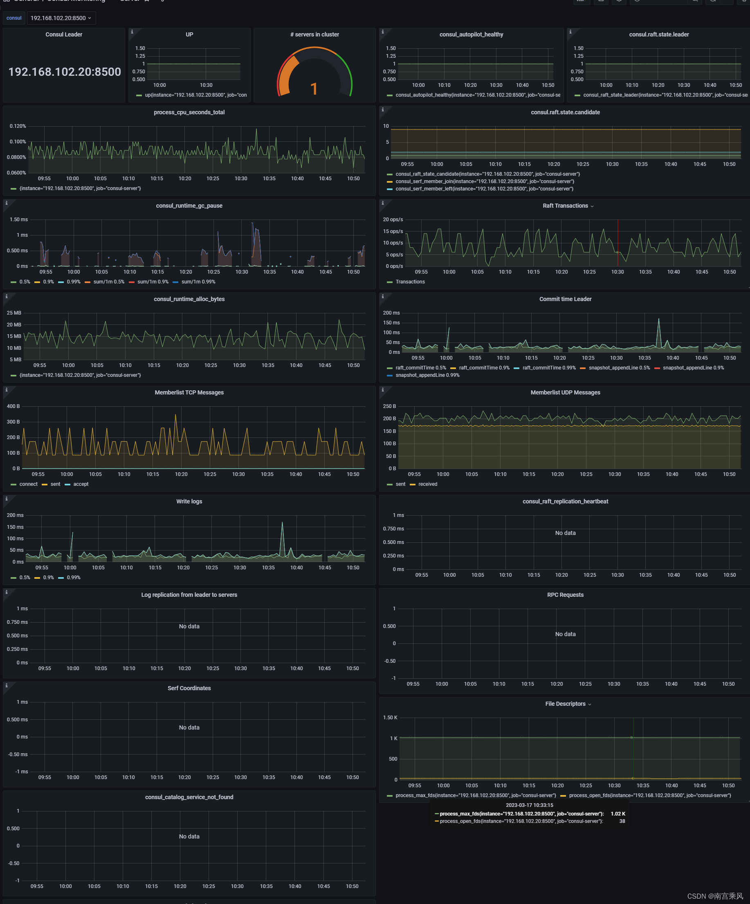

+++
author = "南宫乘风"
title = "Prometheus 和 Grafana 监控 Consul服务端"
date = "2023-03-17 10:57:56"
tags=['prometheus', 'grafana', 'consul']
categories=[]
image = "post/4kdongman/03.jpg"
+++
[作者：南宫乘风   原文链接:https://blog.csdn.net/heian_99/article/details/129614899?spm=1001.2014.3001.5502](https://blog.csdn.net/heian_99/article/details/129614899?spm=1001.2014.3001.5502)

# Prometheus 和 Grafana 监控 Consul

## 简介

Consul是一款常用的服务发现和配置管理工具，可以很好地管理和发现分布式系统中的服务和实例。而Prometheus是一款常用的开源监控和告警系统，可以监控各种不同的系统组件并进行告警和分析。本文将介绍如何使用Prometheus监控Consul服务端，以便更好地管理和分析Consul集群的运行情况。

## 安装Conusl服务端

Conusl版本：Consul v1.5.3

1、首先从官方网站（https://www.consul.io/downloads.html）下载适用于您的操作系统的二进制文件。

2、解压缩下载的文件。例如，在Linux中，您可以使用以下命令解压缩：

```
 unzip consul_1.x.x_linux_amd64.zip

```

3、将解压缩的二进制文件移动到一个目录中，例如`/usr/local/bin`​：

```
sudo mv consul /usr/local/bin/

```

4、创建一个配置文件来配置Consul服务端

```
mkdir -p /etc/consul/ &amp;&amp; cd /etc/consul/


[root@bt consul]# cat consul.hcl
data_dir = "/var/lib/consul"
log_level = "WARN"
enable_syslog = true
server = true
bootstrap = true
ui = true
datacenter = "ownit"
check_update_interval = "0s"
bind_addr = "192.168.102.20"
client_addr = "192.168.102.20"
telemetry {<!-- -->
          prometheus_retention_time = "24h" #Consul自带的监控
                  disable_hostname = true
}

该配置文件指定Consul服务端应该使用的数据中心、是否是服务器节点（server）、启动集群时期望的服务器数量（bootstrap_expect）、数据存储目录（data_dir）、日志级别（log_level）、是否启用syslog（enable_syslog）、是否启用UI（ui）以及HTTP地址（addresses.http）。

```

5、启动Consul服务端

```
vim /usr/lib/systemd/system/consul.service

[Unit]
Description=consul-server
After=network-online.target

[Service]
User=consul
PIDFile=/var/lib/consul/consul-server.pid
ExecStart=/usr/bin/consul agent -config-dir /etc/consul -pid-file /var/lib/consul/consul-server.pid -log-file /var/log/consul/consul-server.log
ExecReload=/bin/kill -s SIGHUP $MAINPID
ExecStop=/bin/kill -INT $MAINPID

[Install]
WantedBy=multi-user.target


systemctl daemon-reload  &amp;&amp; systemctl restart consul

```


## Prometheus架构

Prometheus监控系统由以下几个主要组件组成：
1. Prometheus Server：用于存储和查询监控指标数据。1. Exporter：用于将不同的应用程序、系统组件或服务的监控指标数据转换为Prometheus可以处理的格式。1. Alertmanager：用于接收来自Prometheus Server的告警信息，并进行处理和发送告警通知。
## 方法一、Exporter监控Consul服务端

要将Consul服务端的监控指标数据导入到Prometheus中，可以使用Consul的官方Exporter或第三方Exporter。这些Exporter将Consul的运行指标数据暴露为Prometheus可以处理的格式。下面以官方Exporter为例进行介绍。
1.  <h3>安装Consul Exporter</h3> 
可以通过以下命令来下载Consul Exporter：

```
wget https://github.com/prometheus/consul_exporter/releases/download/v0.6.0/consul_exporter-0.6.0.linux-amd64.tar.gz

```
1.  <h3>配置Consul Exporter</h3> 
需要创建一个systemd服务文件

```
vim /usr/lib/systemd/system/consul_exporter.service

[Unit]
Description=Consul Exporter
After=network.target

[Service]
Type=simple
#User=conusl
ExecStart=/usr/local/consul_exporter/consul_exporter --consul.server=192.168.102.20:8500
Restart=always

[Install]
WantedBy=multi-user.target


systemctl daemon-reload &amp;&amp;  systemctl restart consul_exporter
systemctl status consul_exporter

```


访问地址： http://192.168.102.20:9107/metrics



### 3、配置prometheus文件

```
  - job_name: 'consul'
    scrape_interval: 10s
    scrape_timeout: 10s
    static_configs:
    - targets: ['192.168.102.20:9107']


```

### 4、grafana导入模板

https://hellowoodes.oss-cn-beijing.aliyuncs.com/picture/custom-consul-grafana-dashboard.json



https://grafana.com/grafana/dashboards/12049-consul-exporter-dashboard/



‍

## 方法二、Consul服务端自带监控

### 1、配置Consul

```
telemetry {<!-- -->
          prometheus_retention_time = "24h" #Consul自带的监控
                  disable_hostname = true
}

```

### 2、prometheus配置

```
  - job_name: consul-server
    honor_timestamps: true
    scrape_interval: 15s
    scrape_timeout: 10s
    metrics_path: '/v1/agent/metrics'
    scheme: http
    params:
      format: ["prometheus"]
    static_configs:
    - targets:
      - 192.168.102.20:8500


```

### 3、grafana配置

https://grafana.com/grafana/dashboards/2351-consul/

点击左侧`+`​按钮，选择 `import`​，输入Dashboard ID为 `10642`​，选择Prometheus为刚才添加的数据源，点击Import后即可看到监控面板


