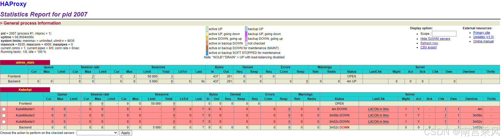
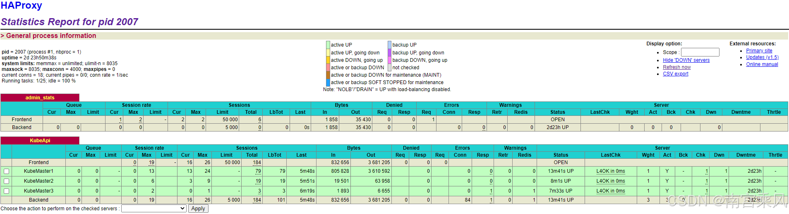

<!--more-->

1. **HAProxy + Keepalived 部署高可用性入口：**
   - 部署两台或多台节点运行 HAProxy 作为负载均衡器。
   - 使用 Keepalived 实现 VIP（虚拟 IP），为 HAProxy 提供高可用性。Keepalived 会监控 HAProxy 的状态，如果主节点失效，VIP 会自动漂移到备用节点，确保高可用性。
2. **HAProxy 配置：**
   - HAProxy 会作为 Kubernetes 的入口，转发流量到 Kubernetes 集群的 `apiserver`。
   - 配置 HAProxy 负载均衡规则，分发流量到多个 Kubernetes master 节点的 API server。
3. **Keepalived 配置：**
   - Keepalived 会监控 HAProxy 的状态，确保在节点失效时自动切换到备用服务器，保障服务连续性。
   - 配置高优先级的主节点和低优先级的备份节点，当主节点不可用时，VIP 切换到备份节点。
4. **办公网络打通：**
   - 办公网络通过 VPN 或路由器配置，将办公网络和 Kubernetes 集群的网络打通。
   - 确保办公网络能够通过 VIP 访问 Kubernetes 集群服务，包括 API server 和集群内的其他服务。

## 环境准备
### 环境
系统版本：CentOS 7.5.1804
Kubernetes 版本：v1.23.1
Calico 版本：v3.8.0
### 机器

| 主机名                | IP                             | 角色                   | 安装软件           |
| --------------------- | ------------------------------ | ---------------------- | ------------------ |
| k8s-test-lvs-1.fjf    | 192.168.83.15/vip 192.168.83.3 | 高可用&负载均衡 Master | keepalive、haproxy |
| k8s-test-lvs-2.fjf    | 192.168.83.26/vip 192.168.83.3 | 高可用&负载均衡 Slave  | keepalive、haproxy |
| k8s-test-master-1.fjf | 192.168.83.36                  | Kubernetes Master Node | kubernetes         |
| k8s-test-master-2.fjf | 192.168.83.54                  | Kubernetes Master Node | kubernetes         |
| k8s-test-master-3.fjf | 192.168.83.49                  | Kubernetes Master Node | kubernetes         |
| k8s-test-node-1.fjf   | 192.168.83.52                  | Kubernetes Worker Node | kubernetes         |
| k8s-test-node-2.fjf   | 192.168.83.22                  | Kubernetes Worker Node | kubernetes         |
| k8s-test-node-3.fjf   | 192.168.83.37                  | Kubernetes Worker Node | kubernetes         |


### 网络规划
| 名称     | 网络            | 备注               |
| -------- | --------------- | ------------------ |
| 节点网络 | 192.168.83.0/24 | 容器宿主机所用网络 |
| Pod网络  | 172.15.0.0/16   | 容器网络           |
| Svc 网络 | 172.16.0.0/16   | 服务网络           |

### 系统配置

```bash
# 所有节点关闭Selinux
sed -i "/SELINUX/ s/enforcing/disabled/g" /etc/selinux/config


# 所有节点关闭防火墙
systemctl disable firewalld


# 所有节点配置内核参数
cat > /etc/sysctl.conf <<EOF
net.ipv6.conf.all.disable_ipv6 = 1
net.ipv6.conf.default.disable_ipv6 = 1
net.ipv6.conf.lo.disable_ipv6 = 1

vm.swappiness = 0
net.ipv4.neigh.default.gc_stale_time=120

# see details in https://help.aliyun.com/knowledge_detail/39428.html
net.ipv4.conf.all.rp_filter=0
net.ipv4.conf.default.rp_filter=0
net.ipv4.conf.default.arp_announce = 2
net.ipv4.conf.lo.arp_announce=2
net.ipv4.conf.all.arp_announce=2

# see details in https://help.aliyun.com/knowledge_detail/41334.html
net.ipv4.tcp_max_tw_buckets = 5000
net.ipv4.tcp_syncookies = 1
net.ipv4.tcp_max_syn_backlog = 1024
net.ipv4.tcp_synack_retries = 2

net.ipv4.tcp_fin_timeout = 30

net.bridge.bridge-nf-call-iptables = 1
net.bridge.bridge-nf-call-ip6tables = 1
net.ipv4.ip_forward = 1
EOF
```
如果是在OpenStack中部署，需要关闭所有主机的端口安全组，如果不关闭，pod网络和svc网络将无法正常通信
在openstack控制节点执行

```bash
# 所有节点都需要操作，可以使用for循环批量操作，下面是单主机移除步骤


# 查看端口ID
neutron port-list| grep 192.168.83.15 
| ea065e6c-65d9-457b-a68e-282653c890e5 |      | 9f83fb35aed1422588096b578cc01341 | fa:16:3e:bd:41:81 | {"subnet_id": "710ffde5-d820-4a30-afe2-1dfd6f40e288", "ip_address": "192.168.83.15"} |


# 移除安全组
neutron port-update --no-security-groups ea065e6c-65d9-457b-a68e-282653c890e5
Updated port: ea065e6c-65d9-457b-a68e-282653c890e5


# 关闭端口安全组
neutron port-update ea065e6c-65d9-457b-a68e-282653c890e5 --port-security-enabled=False
Updated port: ea065e6c-65d9-457b-a68e-282653c890e5


# 查看状态
neutron port-show fcf46a43-5a72-4a28-8e57-1eb04ae24c42
+-----------------------+--------------------------------------------------------------------------------------+
| Field                 | Value                                                                                |
+-----------------------+--------------------------------------------------------------------------------------+
| admin_state_up        | True                                                                                 |
| allowed_address_pairs |                                                                                      |
| binding:host_id       | compute6.openstack.fjf                                                               |
| binding:profile       | {}                                                                                   |
| binding:vif_details   | {"port_filter": true}                                                                |
| binding:vif_type      | bridge                                                                               |
| binding:vnic_type     | normal                                                                               |
| created_at            | 2021-07-01T10:13:32Z                                                                 |
| description           |                                                                                      |
| device_id             | 0a10a372-95fa-4b95-a036-ee43675f1ff4                                                 |
| device_owner          | compute:nova                                                                         |
| extra_dhcp_opts       |                                                                                      |
| fixed_ips             | {"subnet_id": "710ffde5-d820-4a30-afe2-1dfd6f40e288", "ip_address": "192.168.83.22"} |
| id                    | fcf46a43-5a72-4a28-8e57-1eb04ae24c42                                                 |
| mac_address           | fa:16:3e:3f:1d:a8                                                                    |
| name                  |                                                                                      |
| network_id            | 02a8d505-af1e-4da5-af08-ed5ea7600293                                                 |
| port_security_enabled | False                                                                                | # 此项为False则代表端口安全组关闭
| project_id            | 9f83fb35aed1422588096b578cc01341                                                     |
| revision_number       | 10                                                                                   |
| security_groups       |                                                                                      | # 此项必须为空
| status                | ACTIVE                                                                               |
| tags                  |                                                                                      |
| tenant_id             | 9f83fb35aed1422588096b578cc01341                                                     |
| updated_at            | 2021-07-01T10:13:42Z                                                                 |
+-----------------------+--------------------------------------------------------------------------------------+
```
## 部署haproxy+keepalived
[192.168.83.15,192.168.83.26]安装haproxy+keepalived

```bash
yum -y install haproxy keepalived
```
[192.168.83.15,192.168.83.26]配置haproxy

```bash
cat > /etc/haproxy/haproxy.cfg <<EOF
global
    log         127.0.0.1 local2
    chroot      /var/lib/haproxy
    pidfile     /var/run/haproxy.pid
    maxconn     4000
    user        haproxy
    group       haproxy
    daemon
 
    stats socket /var/lib/haproxy/stats
 
defaults
    mode                    http
    log                     global
    option                  httplog
    option                  dontlognull
    option http-server-close
    option forwardfor       except 127.0.0.0/8
    option                  redispatch
    retries                 3
    timeout http-request    10s
    timeout queue           1m
    timeout connect         10s
    timeout client          1m
    timeout server          1m
    timeout http-keep-alive 10s
    timeout check           10s
    maxconn                 5000
 
defaults
    mode                    tcp
    option                  redispatch
    option                  abortonclose
    timeout connect         5000s
    timeout client          50000s
    timeout server          50000s
    log 127.0.0.1           local0
    balance                 roundrobin
    maxconn                 50000
 
listen  admin_stats 0.0.0.0:50101
        mode        http
        stats uri   /
        stats realm     Global\ statistics
        stats auth  haproxy:password
        stats hide-version
        stats admin if TRUE
 
listen KubeApi
    bind 0.0.0.0:6443
    mode tcp
    server KubeMaster1 192.168.83.36:6443 weight 1 check port 6443 inter 12000 rise 1 fall 3
    server KubeMaster2 192.168.83.54:6443 weight 1 check port 6443 inter 12000 rise 1 fall 3
    server KubeMaster3 192.168.83.49:6443 weight 1 check port 6443 inter 12000 rise 1 fall 3
EOF
```
[192.168.83.15]配置keepalived

```bash
cat > /etc/keepalived/keepalived.conf <<EOF
! Configuration File for keepalived
 
global_defs {
   router_id LVS_DEVEL
   vrrp_skip_check_adv_addr
   vrrp_strict
   vrrp_garp_interval 0
   vrrp_gna_interval 0
}
 
vrrp_instance VI_1 {
    state MASTER
    interface eth0
    virtual_router_id 52
    priority 100
    advert_int 1
    authentication {
        auth_type PASS
        auth_pass test-pass
    }
    virtual_ipaddress {
        192.168.83.3
    }
}
EOF
```
[192.168.83.26]配置keepalived

```bash
cat > /etc/keepalived/keepalived.conf <<EOF
! Configuration File for keepalived
 
global_defs {
   router_id LVS_DEVEL
   vrrp_skip_check_adv_addr
   vrrp_strict
   vrrp_garp_interval 0
   vrrp_gna_interval 0
}
 
vrrp_instance VI_1 {
    state BACKUP # 与master值不同
    interface eth0
    virtual_router_id 52
    priority 99 # 与master值不同
    advert_int 1
    authentication {
        auth_type PASS
        auth_pass test-pass
    }
    virtual_ipaddress {
        192.168.83.3
    }
}
EOF
```
[192.168.83.15,192.168.83.26]启动服务

```bash
systemctl start haproxy keepalived
systemctl enable haproxy keepalived     
Created symlink from /etc/systemd/system/multi-user.target.wants/haproxy.service to /usr/lib/systemd/system/haproxy.service.
Created symlink from /etc/systemd/system/multi-user.target.wants/keepalived.service to /usr/lib/systemd/system/keepalived.service.
```

查看管理后台，http://192.168.83.3:50101/，账号密码在haproxy配置文件中stats auth字段。
此时所有后端处于Down的状态属于正常情况，因为kubernetes master节点还没有部署

## 部署kubernetes master
[192.168.83.36,192.168.83.54,192.168.83.49]添加Yum源

```bash
# 移除可能存在的组件
yum remove docker docker-common docker-selinux docker-engine
# 安装一些依赖
yum install -y yum-utils device-mapper-persistent-data lvm2
# 配置Docker CE 源
wget -O /etc/yum.repos.d/docker-ce.repo https://download.docker.com/linux/centos/docker-ce.repo
sudo sed -i 's+download.docker.com+mirrors.tuna.tsinghua.edu.cn/docker-ce+' /etc/yum.repos.d/docker-ce.repo
 
 
# Kubernetes
cat > /etc/yum.repos.d/kubernetes.repo <<EOF
[kubernetes]
name=Kubernetes
baseurl=https://mirrors.aliyun.com/kubernetes/yum/repos/kubernetes-el7-x86_64/
enabled=1
gpgcheck=1
repo_gpgcheck=1
gpgkey=https://mirrors.aliyun.com/kubernetes/yum/doc/yum-key.gpg https://mirrors.aliyun.com/kubernetes/yum/doc/rpm-package-key.gpg
EOF
 
 
# 重建缓存
yum makecache fast
```
[192.168.83.36,192.168.83.54,192.168.83.49]安装

```bash
yum -y install docker-ce kubelet-1.23.1 kubeadm-1.23.1 kubectl-1.23.1
```
[192.168.83.36,192.168.83.54,192.168.83.49]添加docker配置

```bash
mkdir /etc/docker
cat > /etc/docker/daemon.json <<EOF
{
  "registry-mirrors": ["https://xxxxxx.mirror.aliyuncs.com"],
  "exec-opts": ["native.cgroupdriver=systemd"],
  "log-driver": "json-file",
  "log-opts": {
        "max-size": "100m",
        "max-file": "10"
  },
  "oom-score-adjust": -1000,
  "live-restore": true
}
EOF
```
[192.168.83.36,192.168.83.54,192.168.83.49]启动服务

```bash
systemctl start docker kubelet
systemctl enable docker kubelet
Created symlink from /etc/systemd/system/multi-user.target.wants/docker.service to /usr/lib/systemd/system/docker.service.
Created symlink from /etc/systemd/system/multi-user.target.wants/kubelet.service to /usr/lib/systemd/system/kubelet.service.
```
[192.168.83.36]创建集群初始化配置文件

```bash
cat > /etc/kubernetes/kubeadm-config.yaml <<EOF
apiVersion: kubeadm.k8s.io/v1beta2
kind: ClusterConfiguration
kubernetesVersion: stable
controlPlaneEndpoint: "192.168.83.3:6443" #VIP，浮动IP，端口固定6443不要修改
kubernetesVersion: v1.15.0
networking:
  podSubnet: 172.15.0.0/16
  serviceSubnet: 172.16.0.0/16
  dnsDomain: k8s-test.fjf # 默认值：cluster.local,在使用svc网络是可以使用此后缀,需要dns指定到k8s内部dns才能完成解析
EOF
```
[192.168.83.36,192.168.83.54,192.168.83.49]手动下载镜像，加速集群初始化

```bash
KUBE_VERSION=v1.15.0
KUBE_PAUSE_VERSION=3.1
ETCD_VERSION=3.3.10
CORE_DNS_VERSION=1.3.1
 
GCR_URL=k8s.gcr.io
ALIYUN_URL=registry.cn-hangzhou.aliyuncs.com/google_containers
 
images=(kube-proxy:${KUBE_VERSION}
kube-scheduler:${KUBE_VERSION}
kube-controller-manager:${KUBE_VERSION}
kube-apiserver:${KUBE_VERSION}
pause:${KUBE_PAUSE_VERSION}
etcd:${ETCD_VERSION}
coredns:${CORE_DNS_VERSION})
 
 
for imageName in ${images[@]} ; do
  docker pull $ALIYUN_URL/$imageName
  docker tag  $ALIYUN_URL/$imageName $GCR_URL/$imageName
  docker rmi $ALIYUN_URL/$imageName
done
```
[192.168.83.36]初始化集群

```bash
# --upload-certs 用于上传证书到集群，其他节点就不需要手动复制证书了
# tee kubeadm-init.log 保存屏幕输出信息，后面节点加入需要此信息
kubeadm init --config=/etc/kubernetes/kubeadm-config.yaml  --upload-certs | tee kubeadm-init.log
# 以下，输出信息
W0705 18:04:22.814808   11579 strict.go:54] error unmarshaling configuration schema.GroupVersionKind{Group:"kubeadm.k8s.io", Version:"v1beta2", Kind:"ClusterConfiguration"}: error converting YAML to JSON: yaml: unmarshal errors:
  line 5: key "kubernetesVersion" already set in map
[init] Using Kubernetes version: v1.15.0
[preflight] Running pre-flight checks
        [WARNING SystemVerification]: this Docker version is not on the list of validated versions: 20.10.7. Latest validated version: 18.09
        [WARNING Hostname]: hostname "k8s-test-master-1.fjf" could not be reached
        [WARNING Hostname]: hostname "k8s-test-master-1.fjf": lookup k8s-test-master-1.fjf on 192.168.81.10:53: no such host
[preflight] Pulling images required for setting up a Kubernetes cluster
[preflight] This might take a minute or two, depending on the speed of your internet connection
[preflight] You can also perform this action in beforehand using 'kubeadm config images pull'
[kubelet-start] Writing kubelet environment file with flags to file "/var/lib/kubelet/kubeadm-flags.env"
[kubelet-start] Writing kubelet configuration to file "/var/lib/kubelet/config.yaml"
[kubelet-start] Activating the kubelet service
[certs] Using certificateDir folder "/etc/kubernetes/pki"
[certs] Generating "etcd/ca" certificate and key
[certs] Generating "apiserver-etcd-client" certificate and key
[certs] Generating "etcd/server" certificate and key
[certs] etcd/server serving cert is signed for DNS names [k8s-test-master-1.fjf localhost] and IPs [192.168.83.36 127.0.0.1 ::1]
[certs] Generating "etcd/peer" certificate and key
[certs] etcd/peer serving cert is signed for DNS names [k8s-test-master-1.fjf localhost] and IPs [192.168.83.36 127.0.0.1 ::1]
[certs] Generating "etcd/healthcheck-client" certificate and key
[certs] Generating "ca" certificate and key
[certs] Generating "apiserver-kubelet-client" certificate and key
[certs] Generating "apiserver" certificate and key
[certs] apiserver serving cert is signed for DNS names [k8s-test-master-1.fjf kubernetes kubernetes.default kubernetes.default.svc kubernetes.default.svc.k8s-test.fjf] and IPs [172.16.0.1 192.168.83.36 192.168.83.3]
[certs] Generating "front-proxy-ca" certificate and key
[certs] Generating "front-proxy-client" certificate and key
[certs] Generating "sa" key and public key
[kubeconfig] Using kubeconfig folder "/etc/kubernetes"
[kubeconfig] Writing "admin.conf" kubeconfig file
[kubeconfig] Writing "kubelet.conf" kubeconfig file
[kubeconfig] Writing "controller-manager.conf" kubeconfig file
[kubeconfig] Writing "scheduler.conf" kubeconfig file
[control-plane] Using manifest folder "/etc/kubernetes/manifests"
[control-plane] Creating static Pod manifest for "kube-apiserver"
[control-plane] Creating static Pod manifest for "kube-controller-manager"
[control-plane] Creating static Pod manifest for "kube-scheduler"
[etcd] Creating static Pod manifest for local etcd in "/etc/kubernetes/manifests"
[wait-control-plane] Waiting for the kubelet to boot up the control plane as static Pods from directory "/etc/kubernetes/manifests". This can take up to 4m0s
[apiclient] All control plane components are healthy after 18.005364 seconds
[upload-config] Storing the configuration used in ConfigMap "kubeadm-config" in the "kube-system" Namespace
[kubelet] Creating a ConfigMap "kubelet-config-1.15" in namespace kube-system with the configuration for the kubelets in the cluster
[upload-certs] Storing the certificates in Secret "kubeadm-certs" in the "kube-system" Namespace
[upload-certs] Using certificate key:
d3123a4998a8715f1c12830d7d54a63aa790fcf3da0cf4b5e7514cd7ffd6e200
[mark-control-plane] Marking the node k8s-test-master-1.fjf as control-plane by adding the label "node-role.kubernetes.io/master=''"
[mark-control-plane] Marking the node k8s-test-master-1.fjf as control-plane by adding the taints [node-role.kubernetes.io/master:NoSchedule]
[bootstrap-token] Using token: mpzs9m.oec6ixeesemzbxle
[bootstrap-token] Configuring bootstrap tokens, cluster-info ConfigMap, RBAC Roles
[bootstrap-token] configured RBAC rules to allow Node Bootstrap tokens to post CSRs in order for nodes to get long term certificate credentials
[bootstrap-token] configured RBAC rules to allow the csrapprover controller automatically approve CSRs from a Node Bootstrap Token
[bootstrap-token] configured RBAC rules to allow certificate rotation for all node client certificates in the cluster
[bootstrap-token] Creating the "cluster-info" ConfigMap in the "kube-public" namespace
[addons] Applied essential addon: CoreDNS
[addons] Applied essential addon: kube-proxy
 
Your Kubernetes control-plane has initialized successfully!
 
To start using your cluster, you need to run the following as a regular user:
 
  mkdir -p $HOME/.kube
  sudo cp -i /etc/kubernetes/admin.conf $HOME/.kube/config
  sudo chown $(id -u):$(id -g) $HOME/.kube/config
 
You should now deploy a pod network to the cluster.
Run "kubectl apply -f [podnetwork].yaml" with one of the options listed at:
  https://kubernetes.io/docs/concepts/cluster-administration/addons/
 
You can now join any number of the control-plane node running the following command on each as root:
# Master加入
  kubeadm join 192.168.83.3:6443 --token mpzs9m.oec6ixeesemzbxle \
    --discovery-token-ca-cert-hash sha256:7c05c8001693061902d6f20947fbc60c1b6a12e9ded449e6c59a71e6448fac5d \
    --experimental-control-plane --certificate-key d3123a4998a8715f1c12830d7d54a63aa790fcf3da0cf4b5e7514cd7ffd6e200
 
Please note that the certificate-key gives access to cluster sensitive data, keep it secret!
As a safeguard, uploaded-certs will be deleted in two hours; If necessary, you can use
"kubeadm init phase upload-certs --upload-certs" to reload certs afterward.
 
Then you can join any number of worker nodes by running the following on each as root:
# Worker节点接入
kubeadm join 192.168.83.3:6443 --token mpzs9m.oec6ixeesemzbxle \
    --discovery-token-ca-cert-hash sha256:7c05c8001693061902d6f20947fbc60c1b6a12e9ded449e6c59a71e6448fac5d
```

[192.168.83.54,192.168.83.49]其他master节点加入集群

```bash
# 此命令直接复制上一步输出的结果就可以了，注意区分master节点和worker节点的指令是不同的
kubeadm join 192.168.83.3:6443 --token mpzs9m.oec6ixeesemzbxle \
    --discovery-token-ca-cert-hash sha256:7c05c8001693061902d6f20947fbc60c1b6a12e9ded449e6c59a71e6448fac5d \
    --experimental-control-plane --certificate-key d3123a4998a8715f1c12830d7d54a63aa790fcf3da0cf4b5e7514cd7ffd6e200
# 以下，输出信息
Flag --experimental-control-plane has been deprecated, use --control-plane instead
[preflight] Running pre-flight checks
        [WARNING SystemVerification]: this Docker version is not on the list of validated versions: 20.10.7. Latest validated version: 18.09
        [WARNING Hostname]: hostname "k8s-test-master-2.fjf" could not be reached
        [WARNING Hostname]: hostname "k8s-test-master-2.fjf": lookup k8s-test-master-2.fjf on 192.168.81.10:53: no such host
[preflight] Reading configuration from the cluster...
[preflight] FYI: You can look at this config file with 'kubectl -n kube-system get cm kubeadm-config -oyaml'
[preflight] Running pre-flight checks before initializing the new control plane instance
[preflight] Pulling images required for setting up a Kubernetes cluster
[preflight] This might take a minute or two, depending on the speed of your internet connection
[preflight] You can also perform this action in beforehand using 'kubeadm config images pull'
[download-certs] Downloading the certificates in Secret "kubeadm-certs" in the "kube-system" Namespace
[certs] Using certificateDir folder "/etc/kubernetes/pki"
[certs] Generating "etcd/server" certificate and key
[certs] etcd/server serving cert is signed for DNS names [k8s-test-master-2.fjf localhost] and IPs [192.168.83.54 127.0.0.1 ::1]
[certs] Generating "etcd/peer" certificate and key
[certs] etcd/peer serving cert is signed for DNS names [k8s-test-master-2.fjf localhost] and IPs [192.168.83.54 127.0.0.1 ::1]
[certs] Generating "etcd/healthcheck-client" certificate and key
[certs] Generating "apiserver-etcd-client" certificate and key
[certs] Generating "apiserver-kubelet-client" certificate and key
[certs] Generating "apiserver" certificate and key
[certs] apiserver serving cert is signed for DNS names [k8s-test-master-2.fjf kubernetes kubernetes.default kubernetes.default.svc kubernetes.default.svc.k8s-test.fjf] and IPs [172.16.0.1 192.168.83.54 192.168.83.3]
[certs] Generating "front-proxy-client" certificate and key
[certs] Valid certificates and keys now exist in "/etc/kubernetes/pki"
[certs] Using the existing "sa" key
[kubeconfig] Generating kubeconfig files
[kubeconfig] Using kubeconfig folder "/etc/kubernetes"
[kubeconfig] Writing "admin.conf" kubeconfig file
[kubeconfig] Writing "controller-manager.conf" kubeconfig file
[kubeconfig] Writing "scheduler.conf" kubeconfig file
[control-plane] Using manifest folder "/etc/kubernetes/manifests"
[control-plane] Creating static Pod manifest for "kube-apiserver"
[control-plane] Creating static Pod manifest for "kube-controller-manager"
[control-plane] Creating static Pod manifest for "kube-scheduler"
[check-etcd] Checking that the etcd cluster is healthy
[kubelet-start] Downloading configuration for the kubelet from the "kubelet-config-1.15" ConfigMap in the kube-system namespace
[kubelet-start] Writing kubelet configuration to file "/var/lib/kubelet/config.yaml"
[kubelet-start] Writing kubelet environment file with flags to file "/var/lib/kubelet/kubeadm-flags.env"
[kubelet-start] Activating the kubelet service
[kubelet-start] Waiting for the kubelet to perform the TLS Bootstrap...
[etcd] Announced new etcd member joining to the existing etcd cluster
[etcd] Wrote Static Pod manifest for a local etcd member to "/etc/kubernetes/manifests/etcd.yaml"
[etcd] Waiting for the new etcd member to join the cluster. This can take up to 40s
[upload-config] Storing the configuration used in ConfigMap "kubeadm-config" in the "kube-system" Namespace
[mark-control-plane] Marking the node k8s-test-master-2.fjf as control-plane by adding the label "node-role.kubernetes.io/master=''"
[mark-control-plane] Marking the node k8s-test-master-2.fjf as control-plane by adding the taints [node-role.kubernetes.io/master:NoSchedule]
 
This node has joined the cluster and a new control plane instance was created:
 
* Certificate signing request was sent to apiserver and approval was received.
* The Kubelet was informed of the new secure connection details.
* Control plane (master) label and taint were applied to the new node.
* The Kubernetes control plane instances scaled up.
* A new etcd member was added to the local/stacked etcd cluster.
 
To start administering your cluster from this node, you need to run the following as a regular user:
 
        mkdir -p $HOME/.kube
        sudo cp -i /etc/kubernetes/admin.conf $HOME/.kube/config
        sudo chown $(id -u):$(id -g) $HOME/.kube/config
 
Run 'kubectl get nodes' to see this node join the cluster.
```
[192.168.83.36,192.168.83.54,192.168.83.49]创建集群配置文件

```bash
mkdir -p $HOME/.kube
sudo cp -i /etc/kubernetes/admin.conf $HOME/.kube/config
sudo chown $(id -u):$(id -g) $HOME/.kube/config
```
检查集群状态

```bash
kubectl get node
NAME                    STATUS     ROLES    AGE     VERSION
k8s-test-master-1.fjf   NotReady   master   7m19s   v1.15.0
k8s-test-master-2.fjf   NotReady   master   112s    v1.15.0
k8s-test-master-3.fjf   NotReady   master   62s     v1.15.0
 
 
kubectl get pod -A
NAMESPACE     NAME                                            READY   STATUS    RESTARTS   AGE
kube-system   coredns-5c98db65d4-6kxg6                        0/1     Pending   0          7m30s  # Pending状态正常，在安装网络组件后即可恢复
kube-system   coredns-5c98db65d4-x6x4b                        0/1     Pending   0          7m30s  # Pending状态正常，在安装网络组件后即可恢复
kube-system   etcd-k8s-test-master-1.fjf                      1/1     Running   0          6m37s
kube-system   etcd-k8s-test-master-2.fjf                      1/1     Running   0          2m22s
kube-system   etcd-k8s-test-master-3.fjf                      1/1     Running   0          93s
kube-system   kube-apiserver-k8s-test-master-1.fjf            1/1     Running   0          6m31s
kube-system   kube-apiserver-k8s-test-master-2.fjf            1/1     Running   0          2m22s
kube-system   kube-apiserver-k8s-test-master-3.fjf            1/1     Running   1          91s
kube-system   kube-controller-manager-k8s-test-master-1.fjf   1/1     Running   1          6m47s
kube-system   kube-controller-manager-k8s-test-master-2.fjf   1/1     Running   0          2m22s
kube-system   kube-controller-manager-k8s-test-master-3.fjf   1/1     Running   0          22s
kube-system   kube-proxy-hrfgq                                1/1     Running   0          2m23s
kube-system   kube-proxy-nlm68                                1/1     Running   0          93s
kube-system   kube-proxy-tt8dg                                1/1     Running   0          7m30s
kube-system   kube-scheduler-k8s-test-master-1.fjf            1/1     Running   1          6m28s
kube-system   kube-scheduler-k8s-test-master-2.fjf            1/1     Running   0          2m22s
kube-system   kube-scheduler-k8s-test-master-3.fjf            1/1     Running   0          21s
```
查看管理后台，http://192.168.83.3:50101/，账号密码在haproxy配置文件中stats auth字段。
所有Master节点状态为UP则为正常，如果不是，检查前面的步骤是否全部完成，并且输出内容一致

## 部署kubernetes 网络组件
- 目前主要支持的CNI组件
CNI插件：Flannel、Calico、Weave和Canal(技术上是多个插件的组合)

本次部署，使用Calico组件，可以使用改组件的BGP功能与内网打通Pod和SVC网络

- 在Kubernetes集群中部署Calico，在任一Master节点执行即可

```bash
# 下载calico部署文件
wget https://docs.projectcalico.org/v3.8/manifests/calico.yaml
# 修改CIDR
- name: CALICO_IPV4POOL_CIDR
  value: "172.15.0.0/16"  #修改为Pod的网络
# 部署calico
kubectl apply -f calico.yaml
# 以下为输出
configmap/calico-config created
customresourcedefinition.apiextensions.k8s.io/felixconfigurations.crd.projectcalico.org created
customresourcedefinition.apiextensions.k8s.io/ipamblocks.crd.projectcalico.org created
customresourcedefinition.apiextensions.k8s.io/blockaffinities.crd.projectcalico.org created
customresourcedefinition.apiextensions.k8s.io/ipamhandles.crd.projectcalico.org created
customresourcedefinition.apiextensions.k8s.io/ipamconfigs.crd.projectcalico.org created
customresourcedefinition.apiextensions.k8s.io/bgppeers.crd.projectcalico.org created
customresourcedefinition.apiextensions.k8s.io/bgpconfigurations.crd.projectcalico.org created
customresourcedefinition.apiextensions.k8s.io/ippools.crd.projectcalico.org created
customresourcedefinition.apiextensions.k8s.io/hostendpoints.crd.projectcalico.org created
customresourcedefinition.apiextensions.k8s.io/clusterinformations.crd.projectcalico.org created
customresourcedefinition.apiextensions.k8s.io/globalnetworkpolicies.crd.projectcalico.org created
customresourcedefinition.apiextensions.k8s.io/globalnetworksets.crd.projectcalico.org created
customresourcedefinition.apiextensions.k8s.io/networkpolicies.crd.projectcalico.org created
customresourcedefinition.apiextensions.k8s.io/networksets.crd.projectcalico.org created
clusterrole.rbac.authorization.k8s.io/calico-kube-controllers created
clusterrolebinding.rbac.authorization.k8s.io/calico-kube-controllers created
clusterrole.rbac.authorization.k8s.io/calico-node created
clusterrolebinding.rbac.authorization.k8s.io/calico-node created
daemonset.apps/calico-node created
serviceaccount/calico-node created
deployment.apps/calico-kube-controllers created
serviceaccount/calico-kube-controllers created
```
等待CNI生效

```bash
watch kubectl get pods --all-namespaces
 
 
# 所有Pod状态为Running后即可退出
Every 2.0s: kubectl get pods --all-namespaces                                                                                                                        Mon Jul  5 18:49:49 2021
 
NAMESPACE     NAME                                            READY   STATUS    RESTARTS   AGE         
kube-system   calico-kube-controllers-7fc57b95d4-wsvpm        1/1     Running   0          85s
kube-system   calico-node-7f99k                               0/1     Running   0          85s
kube-system   calico-node-jssb6                               0/1     Running   0          85s
kube-system   calico-node-qgvp9                               1/1     Running   0          85s
kube-system   coredns-5c98db65d4-6kxg6                        1/1     Running   0          44m         
kube-system   coredns-5c98db65d4-x6x4b                        1/1     Running   0          44m         
kube-system   etcd-k8s-test-master-1.fjf                      1/1     Running   0          43m         
kube-system   etcd-k8s-test-master-2.fjf                      1/1     Running   0          39m         
kube-system   etcd-k8s-test-master-3.fjf                      1/1     Running   0          38m         
kube-system   kube-apiserver-k8s-test-master-1.fjf            1/1     Running   0          43m         
kube-system   kube-apiserver-k8s-test-master-2.fjf            1/1     Running   0          39m         
kube-system   kube-apiserver-k8s-test-master-3.fjf            1/1     Running   1          38m         
kube-system   kube-controller-manager-k8s-test-master-1.fjf   1/1     Running   1          44m         
kube-system   kube-controller-manager-k8s-test-master-2.fjf   1/1     Running   0          39m         
kube-system   kube-controller-manager-k8s-test-master-3.fjf   1/1     Running   0          37m         
kube-system   kube-proxy-hrfgq                                1/1     Running   0          39m         
kube-system   kube-proxy-nlm68                                1/1     Running   0          38m         
kube-system   kube-proxy-tt8dg                                1/1     Running   0          44m         
kube-system   kube-scheduler-k8s-test-master-1.fjf            1/1     Running   1          43m         
kube-system   kube-scheduler-k8s-test-master-2.fjf            1/1     Running   0          39m         
kube-system   kube-scheduler-k8s-test-master-3.fjf            1/1     Running   0          37m
```

查看CoreDNS状态是否恢复

```bash
kubectl get pod -A -owide
NAMESPACE     NAME                                            READY   STATUS    RESTARTS   AGE   IP               NODE                    NOMINATED NODE   READINESS GATES
kube-system   calico-kube-controllers-7fc57b95d4-zxc4d        1/1     Running   0          88s   172.15.139.1     k8s-test-master-1.fjf   <none>           <none>
kube-system   calico-node-24j88                               1/1     Running   0          89s   192.168.83.36    k8s-test-master-1.fjf   <none>           <none>
kube-system   calico-node-49vnk                               1/1     Running   0          89s   192.168.83.54    k8s-test-master-2.fjf   <none>           <none>
kube-system   calico-node-vzjk8                               1/1     Running   0          89s   192.168.83.49    k8s-test-master-3.fjf   <none>           <none>
kube-system   coredns-5c98db65d4-frfx7                        1/1     Running   0          16s   172.15.159.129   k8s-test-master-2.fjf   <none>           <none> # 状态已经为Running  
kube-system   coredns-5c98db65d4-tt9w5                        1/1     Running   0          27s   172.15.221.1     k8s-test-master-3.fjf   <none>           <none> # 状态已经为Running  
kube-system   etcd-k8s-test-master-1.fjf                      1/1     Running   0          48m   192.168.83.36    k8s-test-master-1.fjf   <none>           <none>
kube-system   etcd-k8s-test-master-2.fjf                      1/1     Running   0          44m   192.168.83.54    k8s-test-master-2.fjf   <none>           <none>
kube-system   etcd-k8s-test-master-3.fjf                      1/1     Running   0          43m   192.168.83.49    k8s-test-master-3.fjf   <none>           <none>
kube-system   kube-apiserver-k8s-test-master-1.fjf            1/1     Running   0          48m   192.168.83.36    k8s-test-master-1.fjf   <none>           <none>
kube-system   kube-apiserver-k8s-test-master-2.fjf            1/1     Running   0          44m   192.168.83.54    k8s-test-master-2.fjf   <none>           <none>
kube-system   kube-apiserver-k8s-test-master-3.fjf            1/1     Running   1          43m   192.168.83.49    k8s-test-master-3.fjf   <none>           <none>
kube-system   kube-controller-manager-k8s-test-master-1.fjf   1/1     Running   1          48m   192.168.83.36    k8s-test-master-1.fjf   <none>           <none>
kube-system   kube-controller-manager-k8s-test-master-2.fjf   1/1     Running   0          44m   192.168.83.54    k8s-test-master-2.fjf   <none>           <none>
kube-system   kube-controller-manager-k8s-test-master-3.fjf   1/1     Running   0          42m   192.168.83.49    k8s-test-master-3.fjf   <none>           <none>
kube-system   kube-proxy-hrfgq                                1/1     Running   0          44m   192.168.83.54    k8s-test-master-2.fjf   <none>           <none>
kube-system   kube-proxy-nlm68                                1/1     Running   0          43m   192.168.83.49    k8s-test-master-3.fjf   <none>           <none>
kube-system   kube-proxy-tt8dg                                1/1     Running   0          49m   192.168.83.36    k8s-test-master-1.fjf   <none>           <none>
kube-system   kube-scheduler-k8s-test-master-1.fjf            1/1     Running   1          48m   192.168.83.36    k8s-test-master-1.fjf   <none>           <none>
kube-system   kube-scheduler-k8s-test-master-2.fjf            1/1     Running   0          44m   192.168.83.54    k8s-test-master-2.fjf   <none>           <none>
kube-system   kube-scheduler-k8s-test-master-3.fjf            1/1     Running   0          42m   192.168.83.49    k8s-test-master-3.fjf   <none>           <none>
```
## 部署kuberntes node
[192.168.83.52,192.168.83.22,192.168.83.37]添加Yum源

```bash
# 移除可能存在的组件
yum remove docker docker-common docker-selinux docker-engine
# 安装一些依赖
yum install -y yum-utils device-mapper-persistent-data lvm2
# 配置Docker CE 源
wget -O /etc/yum.repos.d/docker-ce.repo https://download.docker.com/linux/centos/docker-ce.repo
sudo sed -i 's+download.docker.com+mirrors.tuna.tsinghua.edu.cn/docker-ce+' /etc/yum.repos.d/docker-ce.repo
 
 
# Kubernetes
cat > /etc/yum.repos.d/kubernetes.repo <<EOF
[kubernetes]
name=Kubernetes
baseurl=https://mirrors.aliyun.com/kubernetes/yum/repos/kubernetes-el7-x86_64/
enabled=1
gpgcheck=1
repo_gpgcheck=1
gpgkey=https://mirrors.aliyun.com/kubernetes/yum/doc/yum-key.gpg https://mirrors.aliyun.com/kubernetes/yum/doc/rpm-package-key.gpg
EOF
 
 
# 重建缓存
yum makecache fast
```
[192.168.83.52,192.168.83.22,192.168.83.37]安装
```bash

yum -y install kubelet-1.23.1 kubeadm-1.23.1 kubectl-1.23.1
yum install -y docker-ce-18.09.9 docker-ce-cli-18.09.9 containerd.io
```
[192.168.83.52,192.168.83.22,192.168.83.37]添加docker配置

```bash
mkdir /etc/docker
cat > /etc/docker/daemon.json <<EOF
{
  "registry-mirrors": ["https://h3klxkkx.mirror.aliyuncs.com"],
  "exec-opts": ["native.cgroupdriver=systemd"],
  "log-driver": "json-file",
  "log-opts": {
        "max-size": "100m",
        "max-file": "10"
  },
  "oom-score-adjust": -1000,
  "live-restore": true
}
EOF
```
[192.168.83.52,192.168.83.22,192.168.83.37]启动服务

```bash
systemctl start docker kubelet
systemctl enable docker kubelet
Created symlink from /etc/systemd/system/multi-user.target.wants/docker.service to /usr/lib/systemd/system/docker.service.
Created symlink from /etc/systemd/system/multi-user.target.wants/kubelet.service to /usr/lib/systemd/system/kubelet.service.
```
[192.168.83.52,192.168.83.22,192.168.83.37]手动下载镜像，加速集群初始化

```bash
KUBE_VERSION=v1.15.0
KUBE_PAUSE_VERSION=3.1
  
GCR_URL=k8s.gcr.io
ALIYUN_URL=registry.cn-hangzhou.aliyuncs.com/google_containers
  
images=(kube-proxy:${KUBE_VERSION}
pause:${KUBE_PAUSE_VERSION})
  
  
for imageName in ${images[@]} ; do
  docker pull $ALIYUN_URL/$imageName
  docker tag  $ALIYUN_URL/$imageName $GCR_URL/$imageName
  docker rmi $ALIYUN_URL/$imageName
done
```
[192.168.83.52,192.168.83.22,192.168.83.37]加入集群

```bash
# 此命令在初始化Master集群时有记录，如果找不到了，可以参考 http://wiki.fjf.com/pages/viewpage.action?pageId=14682096
kubeadm join 192.168.83.2:6443 --token wiqtis.k4g3jm9z94qykiyl     --discovery-token-ca-cert-hash sha256:2771e3f29b2628edac9c5e1433dff5c3275ab870ad14ca7c9e6adaf1eed3179e
```
在Master节点查看node节点状态

```bash
kubectl get node         
NAME                    STATUS   ROLES    AGE   VERSION
k8s-test-master-1.fjf   Ready    master   73m   v1.15.0
k8s-test-master-2.fjf   Ready    master   68m   v1.15.0
k8s-test-master-3.fjf   Ready    master   67m   v1.15.0
k8s-test-node-1.fjf     Ready    <none>   75s   v1.15.0 #状态为Ready即为成功加入集群
k8s-test-node-2.fjf     Ready    <none>   63s   v1.15.0 #状态为Ready即为成功加入集群
k8s-test-node-3.fjf     Ready    <none>   59s   v1.15.0 #状态为Ready即为成功加入集群
```
## 使用Calico打通Pod网络
**现状**
集群内pod&node可以通过pod ip直接进行访问，容器访问虚拟机没有问题，但是虚拟机不能访问容器，尤其是通过consul注册的服务，必须打通网络后才可以互相调用

**目标**
打通pod和虚拟机的网络，使虚拟机可以访问pod ip
官方文档：https://docs.projectcalico.org/archive/v3.8/networking/bgp

[Kubernetes Master节点]安装calico控制命令calicoctl

```bash
curl -O -L  https://github.com/projectcalico/calicoctl/releases/download/v3.8.9/calicoctl
chmod +x calicoctl
mv calicoctl /usr/bin/calicoctl
```
[calicoctl安装节点]添加calico配置

```bash
mkdir /etc/calico
cat > /etc/calico/calicoctl.cfg <<EOF
apiVersion: projectcalico.org/v3
kind: CalicoAPIConfig
metadata:
spec:
  datastoreType: "kubernetes"
  kubeconfig: "/root/.kube/config"
EOF
 
 
# 测试
calicoctl version
Client Version:    v3.8.9
Git commit:        0991d2fb
Cluster Version:   v3.8.9        # 出现此行代表配置正确
Cluster Type:      k8s,bgp,kdd   # 出现此行代表配置正确
```
[calicoctl安装节点]配置集群路由反射器，node节点与master节点对等、master节点彼此对等

```bash
# 在本环境下将kubernetes master节点作为反射器使用
# 查看节点信息
kubectl get node
NAME                    STATUS   ROLES    AGE     VERSION
k8s-test-master-1.fjf   Ready    master   3d1h    v1.15.0
k8s-test-master-2.fjf   Ready    master   3d1h    v1.15.0
k8s-test-master-3.fjf   Ready    master   3d1h    v1.15.0
k8s-test-node-1.fjf     Ready    <none>   2d23h   v1.15.0
k8s-test-node-2.fjf     Ready    <none>   2d23h   v1.15.0
k8s-test-node-3.fjf     Ready    <none>   2d23h   v1.15.0
 
 
# 导出Master节点配置
calicoctl get node k8s-test-master-1.fjf --export -o yaml > k8s-test-master-1.yml
calicoctl get node k8s-test-master-2.fjf --export -o yaml > k8s-test-master-2.yml
calicoctl get node k8s-test-master-3.fjf --export -o yaml > k8s-test-master-3.yml
 
 
# 在3个Master节点配置中添加以下配置用于标识该节点为反射器
metadata:
  ......
  labels:
    ......
    i-am-a-route-reflector: true
  ......
spec:
  bgp:
    ......
    routeReflectorClusterID: 224.0.0.1
 
 
# 更新节点配置
calicoctl apply -f k8s-test-master-1.yml
calicoctl apply -f k8s-test-master-2.yml
calicoctl apply -f k8s-test-master-3.yml
 
 
# 其他节点与反射器对等
calicoctl apply -f - <<EOF
kind: BGPPeer
apiVersion: projectcalico.org/v3
metadata:
  name: peer-to-rrs
spec:
  nodeSelector: "!has(i-am-a-route-reflector)"
  peerSelector: has(i-am-a-route-reflector)
EOF
 
 
# 反射器彼此对等
calicoctl apply -f - <<EOF
kind: BGPPeer
apiVersion: projectcalico.org/v3
metadata:
  name: rr-mesh
spec:
  nodeSelector: has(i-am-a-route-reflector)
  peerSelector: has(i-am-a-route-reflector)
EOF
```
[calicoctl安装节点]配置Master节点与核心交换机对等

```bash
calicoctl apply -f - <<EOF
apiVersion: projectcalico.org/v3
kind: BGPPeer
metadata:
  name: rr-border
spec:
  nodeSelector: has(i-am-a-route-reflector)
  peerIP: 192.168.83.1
  asNumber: 64512
EOF
# peerIP: 核心交换机IP
# asNumber: 用于和核心交换机对等的ID
```
[192.168.83.1,设备型号：cisco 3650]配置核心交换与Master(反射器)节点对等，这一步需要在对端BGP设备上操作，这里是用核心交换机

```bash
router bgp 64512
bgp router-id 192.168.83.1
neighbor 192.168.83.36 remote-as 64512
neighbor 192.168.83.49 remote-as 64512
neighbor 192.168.83.54 remote-as 64512
```
查看BGP 对等状态

```bash
calicoctl node status
# INFO字段全部为Established 即为正常
Calico process is running.
 
IPv4 BGP status
+---------------+---------------+-------+----------+-------------+
| PEER ADDRESS  |   PEER TYPE   | STATE |  SINCE   |    INFO     |
+---------------+---------------+-------+----------+-------------+
| 192.168.83.1  | node specific | up    | 06:38:55 | Established |
| 192.168.83.54 | node specific | up    | 06:38:55 | Established |
| 192.168.83.22 | node specific | up    | 06:38:55 | Established |
| 192.168.83.37 | node specific | up    | 06:38:55 | Established |
| 192.168.83.49 | node specific | up    | 06:38:55 | Established |
| 192.168.83.52 | node specific | up    | 06:38:55 | Established |
+---------------+---------------+-------+----------+-------------+
 
IPv6 BGP status
No IPv6 peers found.
```
测试，使用其他网段，如192.168.82.0/24的虚拟机ping 某一个pod ip，能正常通信即代表成功

```bash
[dev][root@spring-boot-demo1-192.168.82.85 ~]# ping -c 3 172.15.190.2
PING 172.15.190.2 (172.15.190.2) 56(84) bytes of data.
64 bytes from 172.15.190.2: icmp_seq=1 ttl=62 time=0.677 ms
64 bytes from 172.15.190.2: icmp_seq=2 ttl=62 time=0.543 ms
64 bytes from 172.15.190.2: icmp_seq=3 ttl=62 time=0.549 ms
 
--- 172.15.190.2 ping statistics ---
3 packets transmitted, 3 received, 0% packet loss, time 2000ms
rtt min/avg/max/mdev = 0.543/0.589/0.677/0.067 ms
[dev][root@spring-boot-demo1-192.168.82.85 ~]#
```

## 使用Calico打通Svc网络
**现状**
一般情况下，Kuberntes集群暴露服务的方式有Ingress、NodePort、HostNetwork，这几种方式用在生产环境下是没有问题的，安全性和稳定性有保障。但是在内部开发环境下，使用起来就有诸多不便，开发希望可以直接访问自己的服务，但是Pod IP又是随机变化的，这个时候我们就可以使用SVC IP 或者SVC Name进行访问

**目标**
打通SVC网络，使开发本地可以通过SVC IP 或 SVC Name访问集群服务
官方文档：https://docs.projectcalico.org/archive/v3.8/networking/service-advertisement
注意：前提是已经用BGP打通了Pod网络或已经建立了BGP对等才可以继续进行

[Kubernetes Master]确定SVC网络信息

```bash
kubectl cluster-info dump|grep -i  "service-cluster-ip-range"
# 以下为输出
                            "--service-cluster-ip-range=172.16.0.0/16",
                            "--service-cluster-ip-range=172.16.0.0/16",
                            "--service-cluster-ip-range=172.16.0.0/16",
```
[Kubernetes Master]启用SVC网络广播

```bash
kubectl patch ds -n kube-system calico-node --patch \
    '{"spec": {"template": {"spec": {"containers": [{"name": "calico-node", "env": [{"name": "CALICO_ADVERTISE_CLUSTER_IPS", "value": "172.16.0.0/16"}]}]}}}}'
# 以下为输出
daemonset.extensions/calico-node patched
```
测试，正常情况下启用BGP广播后，3分钟内核心交换即可接收到路由信息

```bash
# 找到集群DNS服务进行测试
kubectl get svc kube-dns -n kube-system
NAME       TYPE        CLUSTER-IP    EXTERNAL-IP   PORT(S)                  AGE
kube-dns   ClusterIP   172.16.0.10   <none>        53/UDP,53/TCP,9153/TCP   3d21h
 
 
# 找一个Pod IP在集群外进行解析测试，如果可以解析到结果说明SVC网络已经打通
[dev][root@spring-boot-demo1-192.168.82.85 ~]# dig -x 172.15.190.2 @172.16.0.10     
 
; <<>> DiG 9.9.4-RedHat-9.9.4-61.el7_5.1 <<>> -x 172.15.190.2 @172.16.0.10
;; global options: +cmd
;; Got answer:
;; ->>HEADER<<- opcode: QUERY, status: NOERROR, id: 23212
;; flags: qr aa rd; QUERY: 1, ANSWER: 1, AUTHORITY: 0, ADDITIONAL: 1
;; WARNING: recursion requested but not available
 
;; OPT PSEUDOSECTION:
; EDNS: version: 0, flags:; udp: 4096
;; QUESTION SECTION:
;2.190.15.172.in-addr.arpa.     IN      PTR
 
;; ANSWER SECTION:
2.190.15.172.in-addr.arpa. 30   IN      PTR     172-15-190-2.ingress-nginx.ingress-nginx.svc.k8s-test.fjf. # 可以正常解析到主机记录
 
;; Query time: 3 msec
;; SERVER: 172.16.0.10#53(172.16.0.10)
;; WHEN: Fri Jul 09 15:26:55 CST 2021
;; MSG SIZE  rcvd: 150
```

