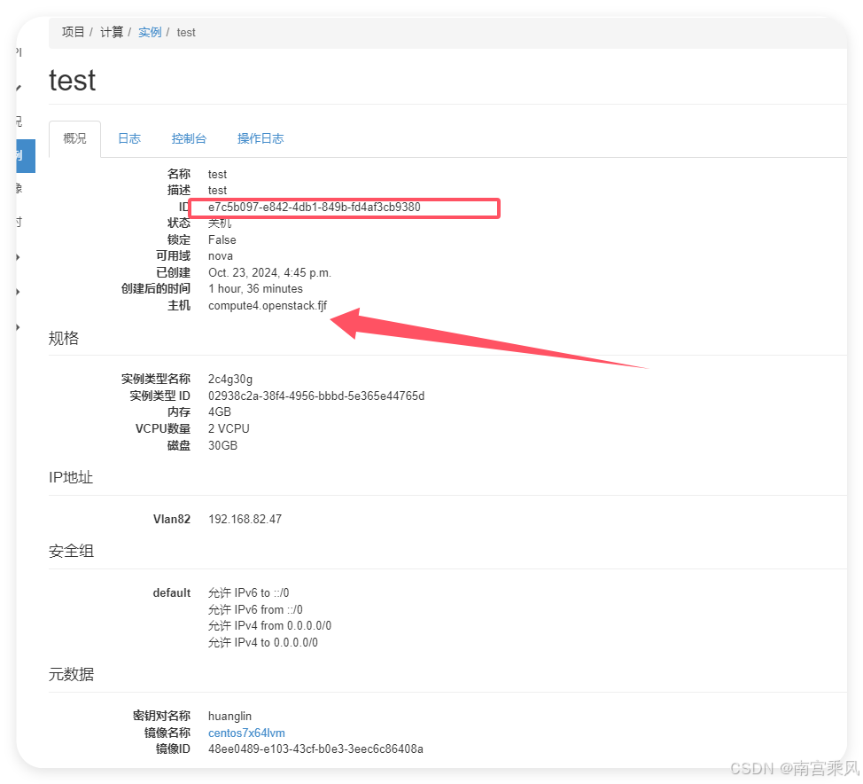
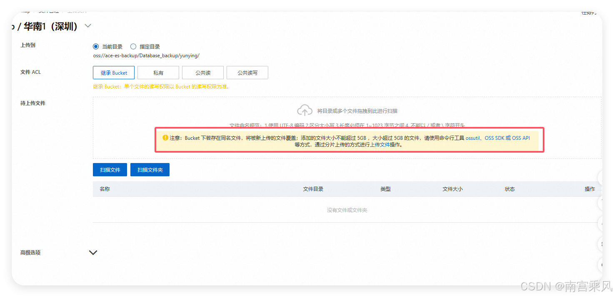
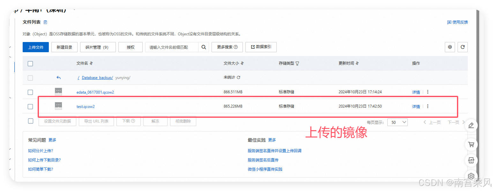
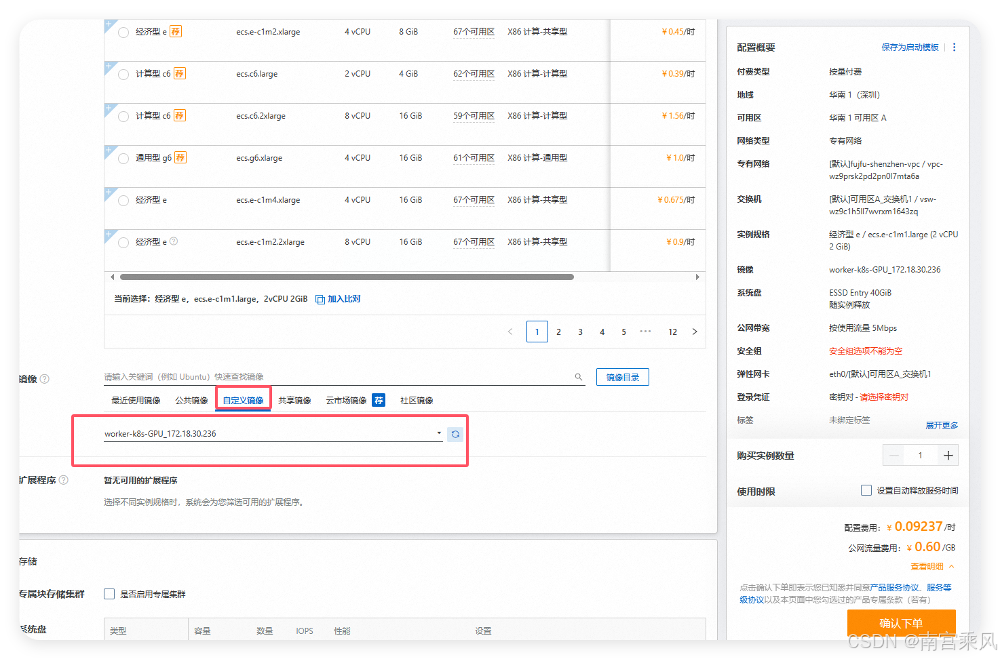

<!--more-->
## 项目背景
OpenStack，作为一个开源的云计算平台，经常被用于构建私有云和公有云服务。然而，随着业务的发展和扩展，企业可能会面临将在OpenStack上运行的虚拟机迁移到其他云服务供应商的需求
## 需求
因为运营团队在本地机房有一台 OpenStack中的虚拟机业务，负责邮件发送，跑定时任务等等。但是由于机房迁移，会导致机房服务中断。但由于考虑业务继续跑，需要把这台机器 迁移到阿里云的环境。但是由于依赖和环境众多，差异性太大，需要有个简便的方式完成迁移。
## 环境介绍
环境介绍
- 源环境：OpenStack 版本（适用于其他版本，但步骤可能略有不同）
- 目标环境：阿里云ECS
- 操作系统：以Centos7 为例（其他Linux发行版的操作可能类似）
- 必要工具：qemu-img（用于转换镜像格式）


## 准备工作
在开始之前，确保您有以下准备：

1. 确认您有足够的权限来访问OpenStack环境和阿里云账户。
2. 安装qemu-img工具，这通常可以在Linux发行版的官方仓库中找到。
3. 确保有足够的本地存储空间来保存导出的QCOW2镜像文件。

## 导出OpenStack虚拟机镜像
首先排查这台机器虚拟机在那台OpenStack宿主机上，
比如我这台OpenStack虚拟机在 compute4.openstack.fjf，
虚拟机id：e7c5b097-e842-4db1-849b-fd4af3cb9380

**进入工作目录**
进入compute4.openstack.fjf 这台OpenStack 的node节点，在进入下方目录
```bash
cd /var/lib/nova/instaces/$your_instance_id$
这个是我的
 cd /var/lib/nova/instances/e7c5b097-e842-4db1-849b-fd4af3cb9380/
```

**导出运行的镜像**
使用qemu-img工具将OpenStack的QCOW2镜像转换为适合阿里云的格式：

如果保存，请关闭虚拟机在试试
```bash
[dev][root@compute4-192.168.81.14 e7c5b097-e842-4db1-849b-fd4af3cb9380]# qemu-img convert -c -O qcow2 disk test.qcow2
qemu-img: Could not open 'disk': Failed to get shared "write" lock
Is another process using the image [disk]?

#这个正常的
qemu-img convert -c -O qcow2 disk test.qcow2
#这个命令会创建一个新的压缩的QCOW2镜像文件
```


## 传镜像到阿里云OSS
在导入镜像到阿里云ECS之前，您需要先将镜像上传到阿里云的对象存储服务（OSS）。

1. 登录到阿里云控制台。
2. 创建一个OSS Bucket。
3. 使用OSS的上传功能或者OSS提供的命令行工具ossutil上传您的QCOW2镜像文件。



## 导入镜像到阿里云ECS
一旦镜像上传到OSS，您可以通过阿里云ECS控制台导入镜像：

1. 在ECS控制台中，找到“镜像和模板”部分。
2. 选择“导入镜像”。
3. 提供OSS中镜像的URL，以及其他必要的信息。
4. 启动导入任务。
阿里云会处理镜像的导入过程，这可能需要一些时间。


## 创建ECS实例
导入镜像完成后，您可以使用该镜像创建新的ECS实例：

1. 在ECS控制台中，选择“实例”。
2. 点击“创建实例”。
3. 在创建向导中，选择您刚刚导入的镜像作为基础。
4. 完成实例的配置，包括选择实例类型、配置网络和安全组等。
5. 启动实例。



## 总结
将OpenStack环境中的虚拟机镜像成功迁移到阿里云ECS。这个过程不仅增强了云资源的可移植性，而且为企业提供了更多的灵活性和选择权。无论是为了成本优化、性能提升还是遵循合规性要求，这种迁移策略都是现代云基础设施管理不可或缺的一部分。
